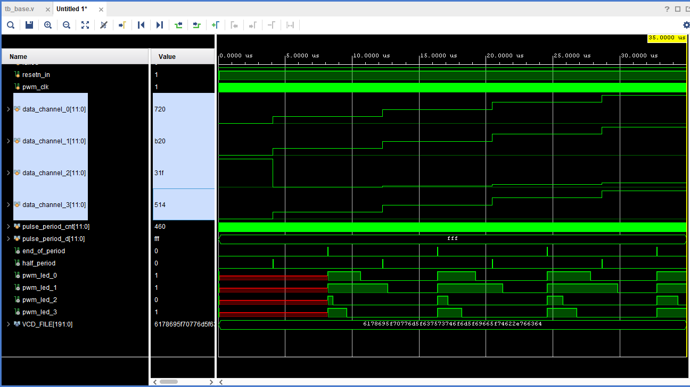

# HDL - Day 3

## Tasks

1. Make the IP
2. Generate PWM that is proportional to the ADC

## Some notes

### IP

To make the IP, it was not that difficult, because the mentors helped us a lot. Theoretically, we should have made a new project, add the IP, configure it, generate it, and then add it to our project. We also should have made a new block design, add the IP in there as well, and connect it to the Zynq processor. We also should have added the AXI GPIO IP, to be able to read the values from the ADC.

Thankfully, the project was already set up, the script were... scripting their way through and everything was going smoothly. We just had to make some modifications and we were done.

### PWM

Here, things got a little more difficult, in the sense that we had to make a PWM generator and make a testbench for it, then analyze the results. We had to make a PWM generator that would take as input a number between 0 and 4059 and output a PWM signal with a duty cycle proportional to the input. Here's a screenshot of the result:

Pretty cool, right? This ended up as way easier than expected.
