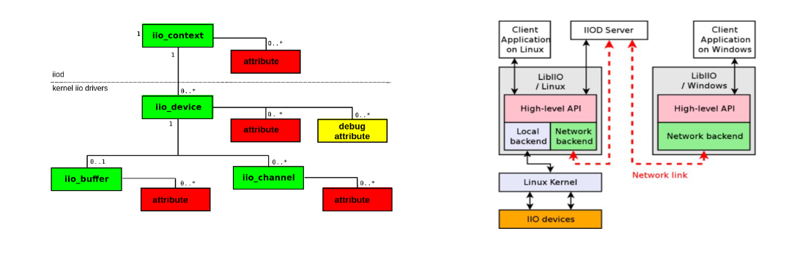

# Day 2 - Apps

Today, it was all about understanding how everything works together and communicates. We took a look at the following diagrams:

After that, we started to learn about CMake and got to generate some neat makefiles. After that, we did some testing with `iio_<app>` command line interface apps, to better understand IIO hierarchy. This will help us in the following day, when we will start to write our own apps.
