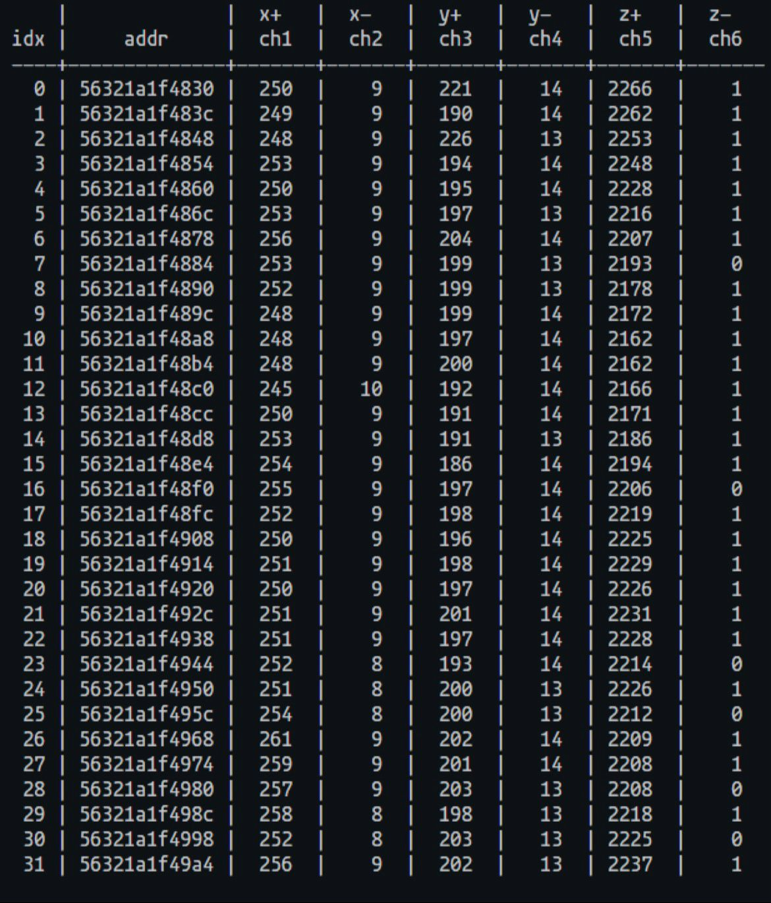

# Day 3 - Apps

The challenges of the day were:

```txt
1. Scrieti programul C "read_adc" care citeste de la ADC valorile de raw ale axelor xpoz,xneg si le afiseaza in urmatorul format:

xpoz <raw> <volts> <acceleration>
xneg <raw> <volts> <acceleration>
ypoz <raw> <volts> <acceleration>
yneg <raw> <volts> <acceleration>
zpoz <raw> <volts> <acceleration>
zneg <raw> <volts> <acceleration>

2. Dupa ce avem programul care ne afiseaza xpoz,xneg, etc .. in raw,volti, si g (acceleratie gravitationala), folositi M2k + Scopy pentru a masura iesirea de la opamp. Validati ca valoarea de volti obtinuta in programul C "" este egala cu iesirea de la opamp.

3. Scrieti un program "read_accel", care afiseaza X,Y,Z in bucla
X: <acceleration> Y:<acceleration> Z:<acceleration>

4. Scrieti un program "calib_accel" care ne ofera instructiuni pentru calibrarea placii:"Place the module on a plane surface"

<read user input>
"Adjust the potentiometers according to instructions"
"POT1: clockwise POT2: counter-clockwise POT3: center" (example)
"POT1: clockwise POT2: counter-clockwise POT3: center"
"POT1: clockwise POT2: center POT3: center"
"POT1: center POT2: center POT3: center"
"Calibrated !"

5. Scrieti un program "shock_detect" care asteapta producerea unui soc. In urma socului programul va afisa "<timestamp> - shock detected"
```

Look at this output!


