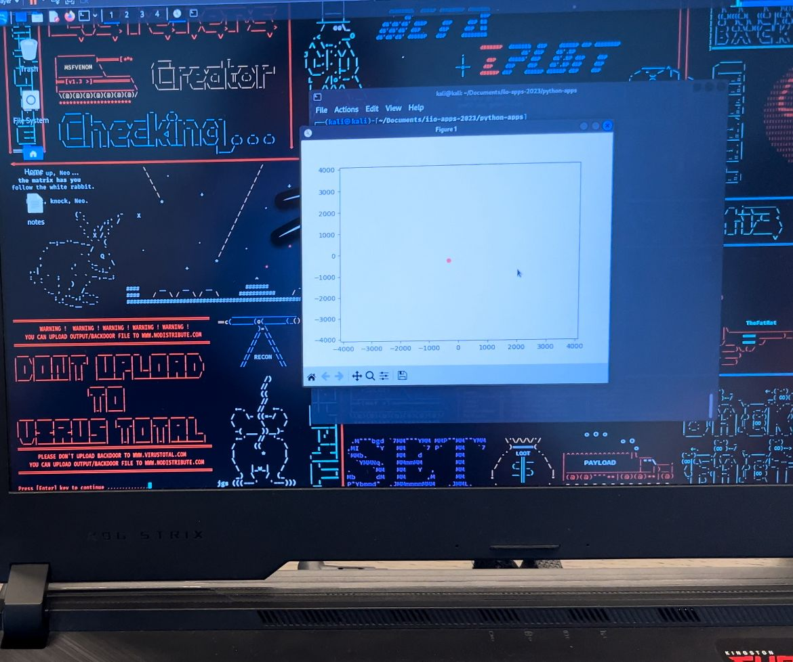

# Day 4 - Apps

We continued the challenges of the previous day and then, after all of them were completed, we started to work on the final app, which was a Python application with graphical interface.

This app used `matlibplot` to draw a level indicator, which was updated in real time, based on the accelerometer data. Here is the code and the result:

```python
import numpy as np
import iio
import matplotlib.pyplot as plt

ctxname = "ip:10.76.84.240"
channel_prefix = "voltage"
nb_channels = 6

def getRaw(channel):
    return int(channel.attrs["raw"].value)

# Get context and device
ctx = iio.Context(ctxname)
dev = ctx.find_device("ad5592r_s")

channels = []
for i in range(6):
# Get all channels
    channels.append(dev.find_channel("{}{}".format(channel_prefix, i)))

while True:
    x = getRaw(channels[0]) - getRaw(channels[1])
    y = getRaw(channels[2]) - getRaw(channels[3])
    z = getRaw(channels[4]) - getRaw(channels[5])
    
    if z < 0:
        z = np.array([z, 0])
    else:
        z = np.array([0, z])
    
    plt.bar(2000, z, width = 500, color = "mediumaquamarine")
    plt.plot(x, y, 'o', color = "mediumpurple")
    plt.axis([-4096, 4096, -4096, 4096])
    plt.pause(0.05)
    plt.clf()
```


