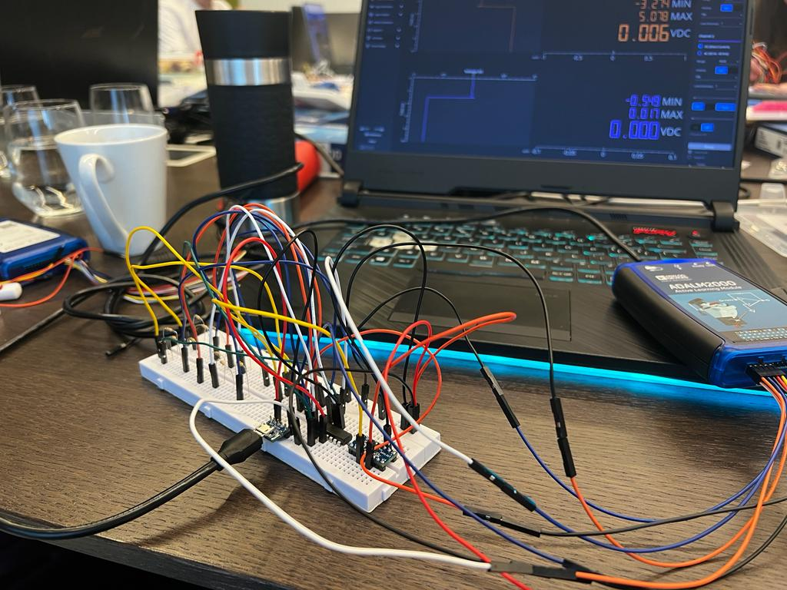
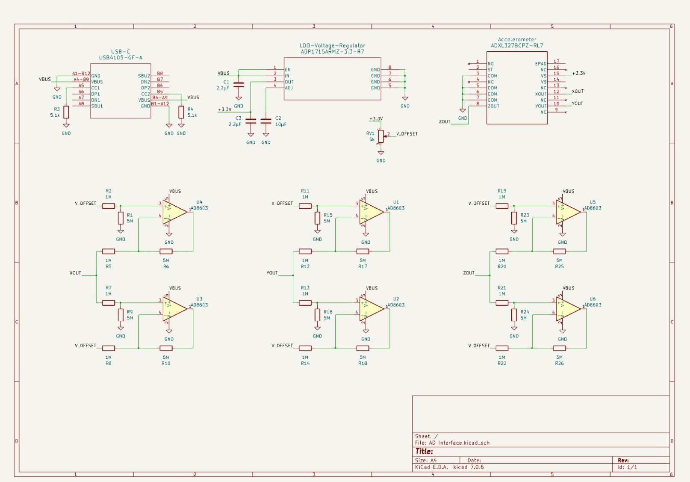
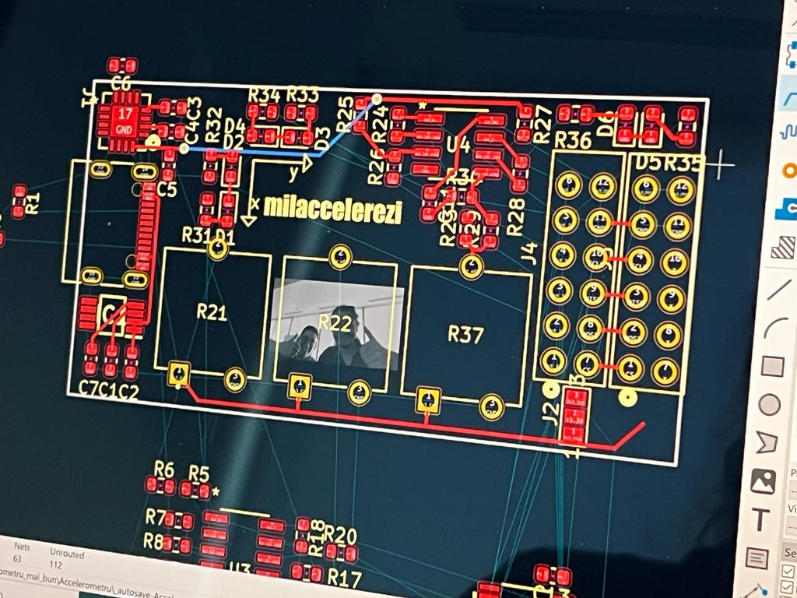
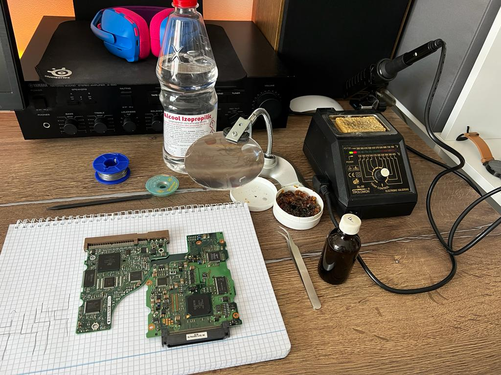

# First week - Electronics

## Day 1 - Software installation and basic circuits

The day started with installing loooots of software, amongst which were *Scopy* and *LTSpice*.

Next task? **Do some electronics labs!** They were pretty cool, as we were given ADALM2000 boards and we had to do some basic circuits with them. We also had to use a breadboard and some resistors, capacitors and LEDs.

We had to do some basic circuits, like a voltage divider, a voltage follower, a low pass filter, a high pass filter, a band pass filter and a band stop filter.

## Day 2 - More circuits and some more serios things

Today, we had to learn some configurations for using Op-Amps and made a buffer. This helped us build a reference output voltage for the next circuit, which was a voltage regulator. Nothing very much to say about this, as it was pretty easy.

## Day 3 - LDO and testing

The task of the day: build a low drop-out voltage regulator. This was a bit more complicated, as we had to use a MOSFET and a BJT. We also had to use a potentiometer to adjust the output voltage.

After most of us were done, we were given a proper LDO encapsulated in a single package.

## Day 4 - Accelerometer to Converter interface, LTSpice

Faced with the problem that the ADC takes a maximum input voltage of 3V, we had to build a circuit that would take the output of the accelerometer and convert it to a voltage that the ADC can read. We used a voltage divider and a buffer to do this.

Furthermore, we tested everything in an LTSpice simulation and it worked! Now, on the breadboard! This is the final result, which was tested with Scopy.

![[../ADXL327.md]]

## Day 5 - KiCad

Now, we must build the schematic. For this, we got familiar with KiCad, UltraLibrarian and we got to build the schematic for the accelerometer to converter interface.

## Day 6 - PCB Layout

Having the schematic all ready and verified by the mentors, we started building the PCB layout. This was a bit more complicated, as we had to use the UltraLibrarian to get the footprints for the components and we had to make sure that everything was connected properly.

![[../PCB Specs.md]]

Anyhow, we managed to finish the PCB layout and we sent it to the mentors for verification. It was okay! Here is a picture from the process:

## Day 7 - Soldering

Everything is ready! Let's get soldering everything on the PCB! Having used small components, this was a bit more complicated, but we managed to do it!

